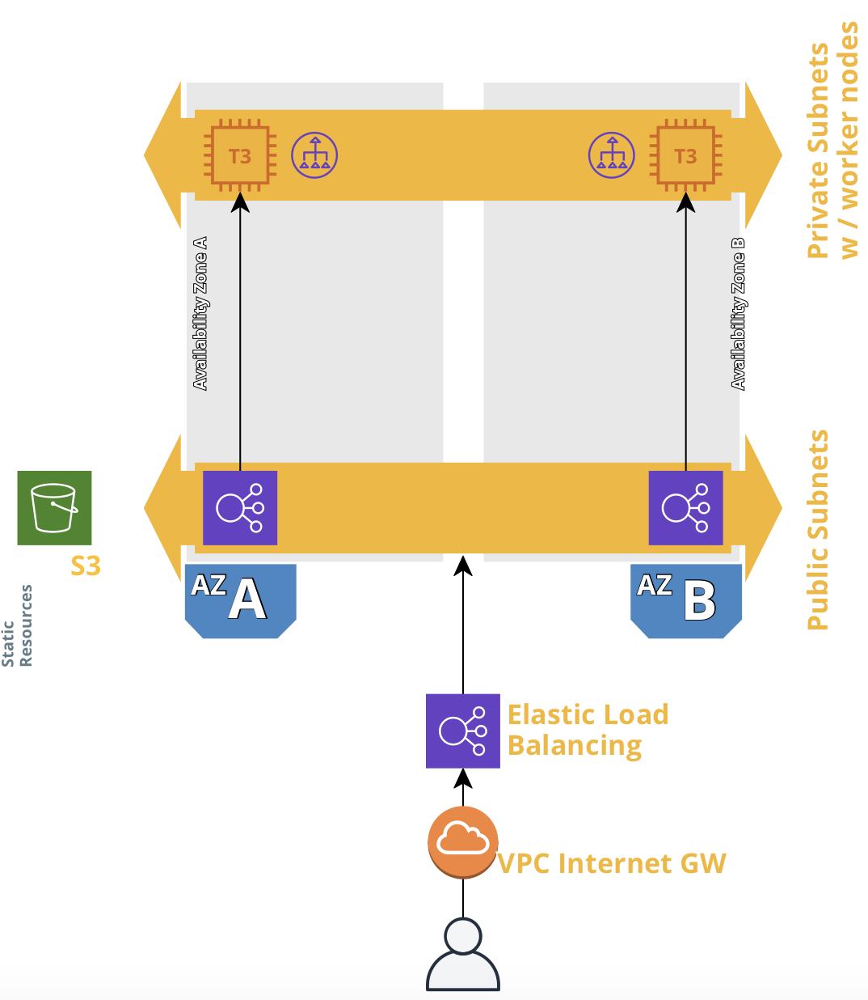

## What is this?
Infrastructure as code (IaC) that builds a Kubernetes Cluster on a high availability
AWS cloud infrastructure, something like this:


## Requirements
- aws account
- aws-cli/1.16.314 (the one I used)

## Installation
1. Set up the VPC and the subnets in a stack.
```bash 
aws cloudformation create-stack --stack-name eks-vpc --region eu-central-1 --template-body file://network.yml --parameters file://network-params.json
```
Pick stack names and a region of your liking.

2. Wait until for the stack to complet and set up the 
Kubernetes cluster
```
aws cloudformation create-stack --stack-name eks --region eu-central-1 --template-body file://cluster.yml --parameters file://cluster-params.json --capabilities CAPABILITY_NAMED_IAM
```
This second stack will take approx 15 minutes to create.  
## Usage
Use it as any other kubernetes cluster. A refereence deployment is provided here.
This deployment will create additonal resources in AWS.
- EC2 instances (automatic creation and removal)
- S3 bucket for the template (to be deleted manually when not needed)
- A Load balanceer (to be deleted manually when not needed)

### Update the resources
```bash
aws cloudformation update-stack --stack-name eks --region eu-central-1 --template-body file://cluster.yml --parameters file://cluster-params.json --capabilities CAPABILITY_NAMED_IAM
```
### Update `kubectl` context
Set up the `kubectl` to control your newly created environment. 
```bash
aws eks --region eu-central-1 update-kubeconfig --name prod
```
`prod` is the name of your ControlPlane.  
### Deploy the reference application
```bash
kubectl apply -f deploy.yml
```
It will take a few minutes before the url comes alive.
Issue `kubectl get svc` command to reveal your public url and test it in a borwser. You should see the _nginx_ welcome page


## Clean-up
Tear down your resources like this
```bash
aws delete-stack --stack-name eks --region eu-central-1
```
Wait for ColudFormation to delete your stack, otherwise the next command will eventually fail when trying to delete dependencies.
```bash
aws delete-stack --stack-name eks-vpc --region eu-central-1
```
---
**NOTE**  
You have to delete the load balancer and the S3 bucket manually.  
---


